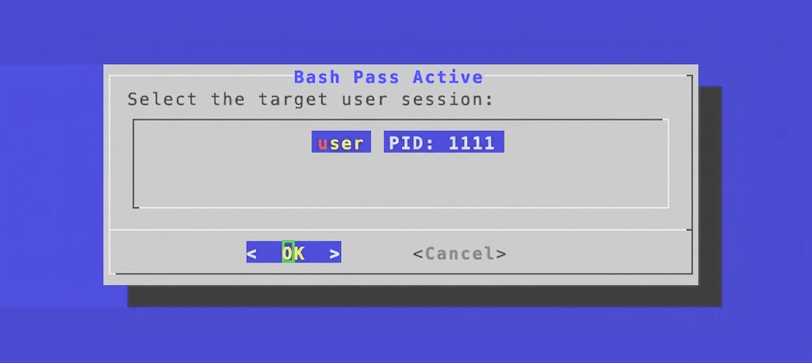
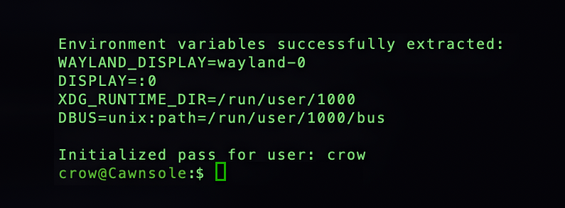

# Cawnsole Bash Pass

Run terminal inside an active session from ssh, as if the terminal window was on screen.  

*This repo is a part of the Cawnsole collection; Improving the HTPC experience.*

| Dependencies |
| --- |
| dialog |
| wayland |
| KDE Plasma |

## Installation & Use
### Installation Steps

1. Download the latest bash-pass.sh file from the releases.
2. Move the bash-pass.sh file anywhere desired on the host system.

### Using Bash Pass

**Bash Pass is meant to be used through SSH from another device.**

1. Connect to a host with Bash Pass, run the shell **with sudo privilege**. 
2. A menu will appear showing the detected sessions. Using the keyboard or mouse select the desired session. 
3. After selection of the desired session, the menu will automatically close and the terminal will clear and confirm the new session you are controlling. 
4. Run any commands now as if you were running them locally in the selected active session.

To leave the session use:
>exit

*This is an example showing Bash Pass signing into a session for a user named "crow" on a system named "Cawnsole".*
