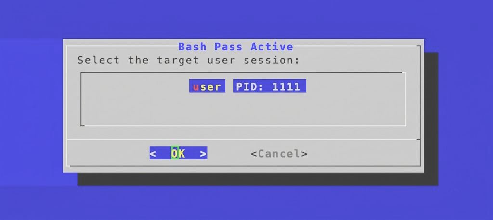
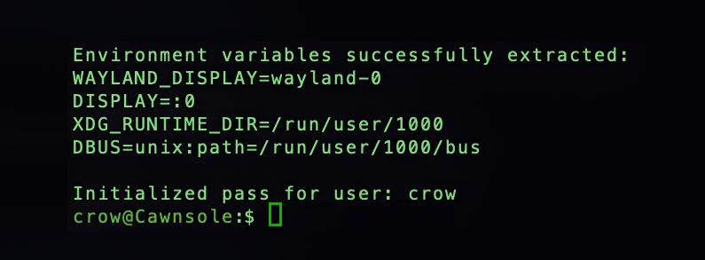
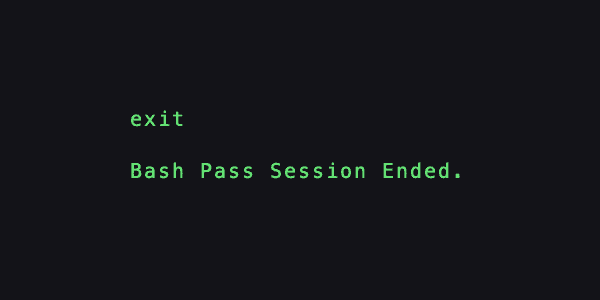

# Cawnsole Bash Pass


Run a terminal inside an active session over SSH, as if the terminal window were on screen.

*This repo is a part of the Cawnsole collection; Improving the HTPC experience.*

[](https://patreon.com/ProCrow?utm_medium=clipboard_copy&utm_source=copyLink&utm_campaign=creatorshare_creator&utm_content=join_link)



<hr>

## What it does

Bash Pass lets you step into another user's live session on a Linux host and drive it from your own SSH connection, exactly as if you were sitting at that screen.

It detects active sessions with `loginctl`, lets you pick one, then grafts that session's environment (`DISPLAY`, `WAYLAND_DISPLAY`, `DBUS_SESSION_BUS_ADDRESS`, ...) into a fresh interactive shell running as the target user. Your own terminal identity stays pinned to your client, so TUI colours render correctly on your side. When the target session ends — or the timer expires — the pass is rescinded automatically.

## Requirements

| Requirement | Notes |
| --- | --- |
| Linux host with systemd | session detection uses `loginctl` |
| Root access | run with `sudo`; needed to read `/proc/<pid>/environ` and switch users |
| `ncurses` (`tput`) | colours; the script degrades gracefully without it |
| `util-linux` (`script`) | only needed for the `-audit` and `-wanted` features |

No `dialog` or `whiptail` — selection is a plain numbered prompt.

## Installation

1. Clone the repo, or just grab `Bash-Pass.sh` and place it anywhere on the host.
2. Make it executable:

   ```
   chmod +x Bash-Pass.sh
   ```

3. Run it with sudo:

   ```
   sudo bash Bash-Pass.sh
   ```

## Usage

**Bash Pass is meant to be used over SSH from another device.**

1. Connect to a host with Bash Pass and run the shell **with sudo privilege**.
2. A table of the detected sessions appears — type the number of the session you want and press Enter.
3. The menu closes, the terminal clears, and the pass is crafted — you are now controlling the target user's session.
4. Run any commands as if you were running them locally in that session.

To leave the session use:

> exit

(Ctrl+D works too.) If the target session's leader process dies, or a `-timer` expires, the pass is rescinded on its own.


*Selecting a session and being dropped into it — here user "crow" on a system named "Cawnsole".*


*Leaving the session with `exit`.*

## Options

| Option | Description |
| --- | --- |
| `-silent` | Suppress all visual feedback and menus. |
| `-list [SORT]` | Display the detected environments without entering one. If `SORT` is provided, filter the list. |
| `-pass [DEST]` | Auto-select the first environment matching `DEST` (matched against user, uid, tty, or type), or the special values `oldest` / `latest`. |
| `-location [PATH]` | Drop into `PATH` upon connection. Fails if the path is missing. |
| `--location [PATH]` | Drop into `PATH` upon connection. Falls back to the default directory if missing. |
| `-audit [PATH]` | Save clean terminal output (ANSI colours stripped) to `PATH` or the default location. |
| `--audit [PATH]` | Save raw terminal output to `PATH` or the default location. |
| `-wanted [STR] [CMD]` | Monitor the session stream for `STR`. Exits when it appears, or executes `CMD` if provided. |
| `-only [CMD]` | Execute `CMD` upon connection, then immediately terminate the session. |
| `-first [CMD]` | Execute `CMD` automatically upon connection, before handing over control. |
| `-last [CMD]` | Execute `CMD` automatically when the session terminates. |
| `-timer [TIME]` | Set an automatic disconnect timeout (e.g. `3.5d`, `5D2H`, `30m`, `10s`). |
| `-help` | Display the full option reference and exit. |

### Notes

- Audit files default to `/tmp/bash-pass/audits/`.
- `-only` cannot be combined with `-first` or `-last`.
- `-wanted` without `CMD` ends the session the moment `STR` appears.
- `-pass` / `-list` matching is a substring match against any column. Graphical sessions are labelled `wayland display` / `x11 display`, so `-pass display` targets the first graphical session.
- `-silent` is handy for automation: no menus, no banners, no flavour text.
