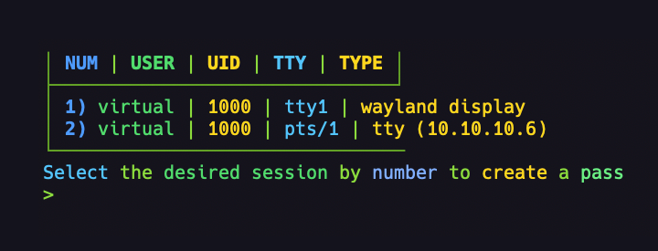
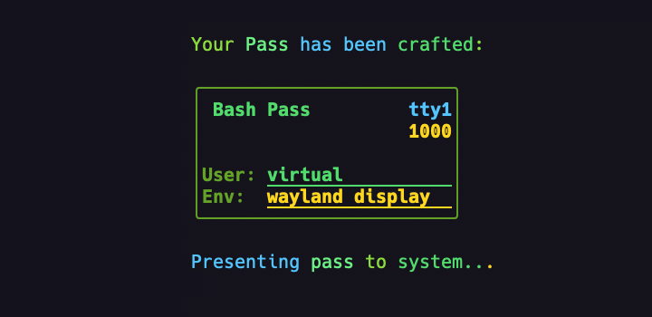

# Bash Pass

Tunnel your terminal session into any other system session, allowing "session parasitizing".

*This repo is a part of the Cawnsole collection; improving the HTPC experience.*

 

## What Bash Pass Does

Bash Pass allows a shell within the system to access other sessions and parasitize them, allowing the shell to behave as if it was originally sourced from the target session.

When the target session ends, or the app is closed, all non-detached processes will also be ended.

#### Session Parasitizing

**The moniker I made for what Bash Pass does is "session parasitizing".** Like a parasite, the app latches onto a host session and uses the host session's own credentials to burrow in and start asserting its will *(maybe a bit too personified a description, but I think it gets the point across in a fun visual way)*.

#### Security Note

***Bash Pass is basically a back door to your system. Use Bash Pass with care, and don't be a dunce.***

## Install & Run Bash Pass

#### Requirements

| Required | Notes |
| --- | --- |
| Linux host with systemd | session detection relies on `loginctl` |
| Root access | Bash Pass will not run without it |

| Semi-Required | Notes |
| --- | --- |
| `util-linux` (`script`) | required for `-audit` & `-wanted` arguments |
| `dialog-utility` | required for `-assist` argument |

### Installing Bash Pass

1. Clone the repo, or download from releases
2. Run the `install-bash-pass.sh` install script or install manually

### Running Bash Pass

Bash Pass can be used in a variety of ways due to its simple and flexible architecture. Simply running Bash Pass plainly is enough for most use cases, but that is the tip of the iceberg. Embedding Bash Pass into larger scripts, making full use of the available arguments, is where the real possibilities are. 

 

**Once installed, run Bash Pass with the `bashpass` command**. 

**Alternatively, run the `pass` file directly as a regular bash script in a shell (e.g. `sudo bash pass`).** 

*Both methods require root access.*

## Using Bash Pass

Bash Pass is stylized as a friendly "pass" creation app, which then uses the created "pass" to access sessions (parasitize onto selected sessions). *This styling of the app extends to its argument names, terminology, and defaults.* 

1. Run Bash Pass **with sudo privilege** from any shell interface (including SSH)
2. Select the desired session to parasitize
3. Use the shell as if it was running locally in that session
4. Type `exit` to detach from the session

### Advanced Usage

Bash Pass offers a wide variety of use cases by supporting a large number of arguments, which for the most part can be used with one another to create powerful functionality. The arguments also allow Bash Pass to be embedded within larger workflows.

| Option | Description |
| --- | --- |
| `-silent` | Suppress all visual feedback and menus. |
| `-assist` | Render the session list with the `dialog` utility for clickable selection. |
| `-list [SORT]` | Display the detected environments without entering one. If `SORT` is provided, filter the list. |
| `-pass [DEST]` | Auto-select the first environment matching `DEST` (matched against user, uid, tty, or type), or the special values `oldest` / `latest`. |
| `-location [PATH]` | Drop into `PATH` upon connection. Falls back to the default directory if the path is missing. |
| `--location [PATH]` | Drop into `PATH` upon connection. Fails if the path is missing. |
| `-audit [PATH]` | Save clean terminal output (ANSI colours stripped) to `PATH` or the default location. |
| `--audit [PATH]` | Save raw terminal output to `PATH` or the default location. |
| `-wanted [STR] [CMD]` | Monitor the session stream for `STR`. Exits when it appears, or executes `CMD` if provided. |
| `-only [CMD]` | Execute `CMD` upon connection, then immediately terminate the session. |
| `-first [CMD]` | Execute `CMD` automatically upon connection, before handing over control. |
| `-last [CMD]` | Execute `CMD` automatically when the session terminates. |
| `-timer [TIME]` | Set an automatic disconnect timeout (e.g. `3.5d`, `5D2H`, `30m`, `10s`). |
| `-help` | Display the full option reference and exit. |
| `-version` | Display the current version number. |

*For a more detailed breakdown of how to use each argument (with examples), check the `WIKI.md`.*